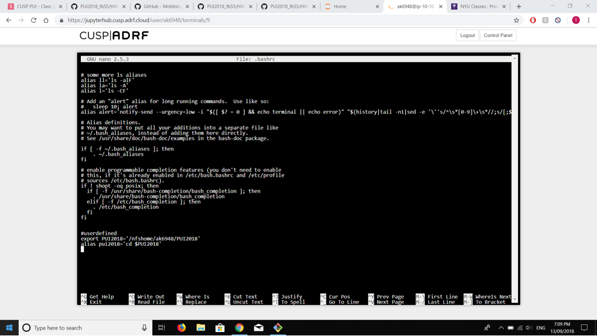
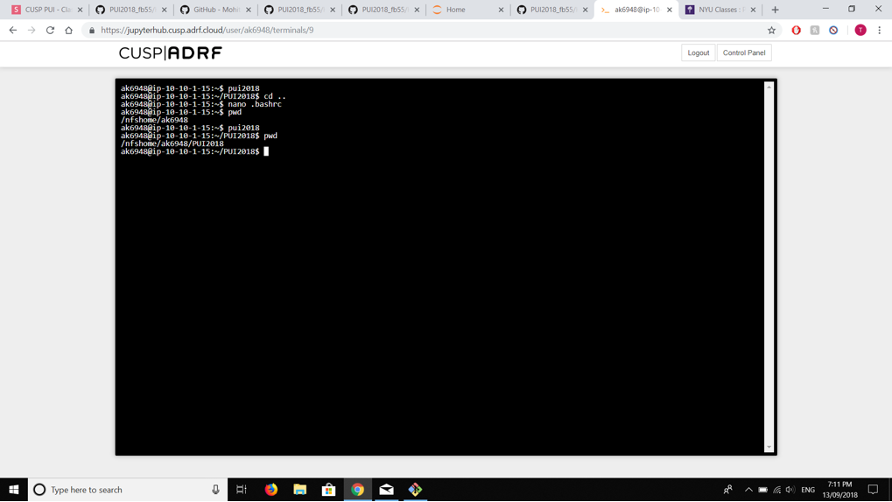

# HW-1

The scope of this Homework was to intialize an environmental variable and learn how to assign an alias to it.

The first step was accessing the .bashrc in order to define an environmental variable for every session not just the current session. "nano .bashrc" command was used to access it.
The export command was the command used to initialize the environmental variable. The environmental variable was defined as "PUI2018".
The "PUI2018" variable was defined as the path to a folder with the same name on the ADRF environment.

The second step was to define an alias for the new environmental variable created. This was done to have an executable shortcut to a command not just a shortcut to a variable.
The 'alias' command was the command used to create an alias. The alias chosen was "pui2018".

Screenshots from the homework are attached below

This is screenshot 1

This is screenshot 2

