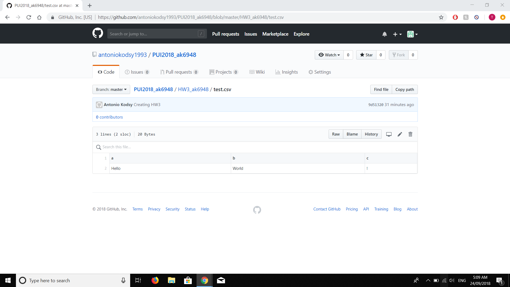
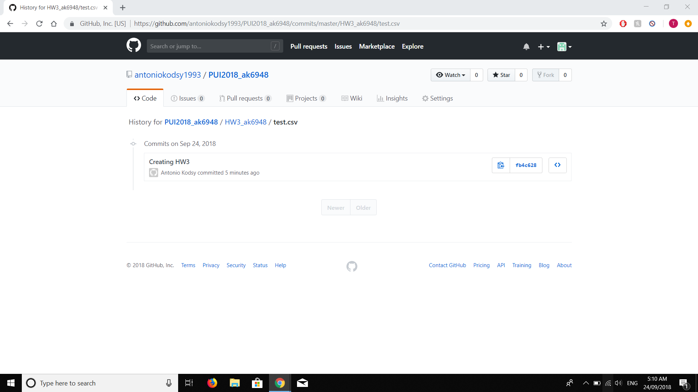
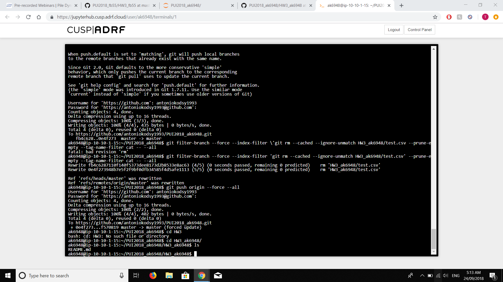

This homework consists of 3 parts. The first part was to delete a file and its history completely from the repository. 

The following screenshots shows the creating of a file, the history of the file, and the absence of the file after deleting.

